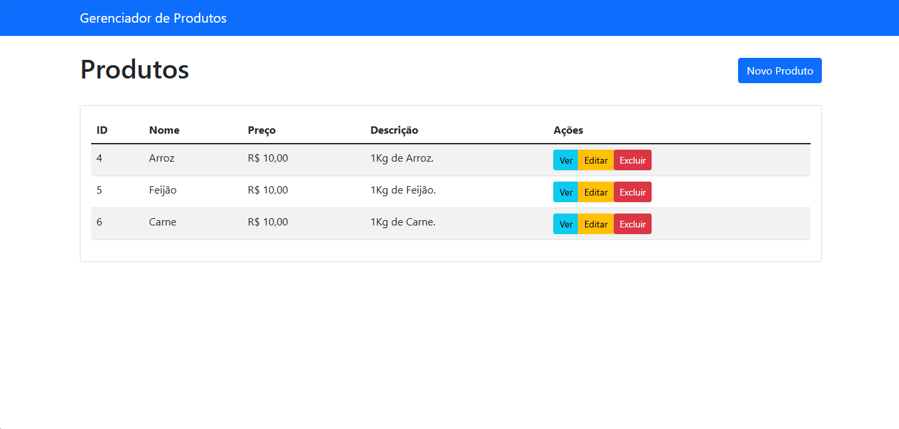

# Gerenciador de Produtos - Laravel

[](https://laravel.com)
[](https://php.net)
[](https://getbootstrap.com)

Sistema CRUD completo para gerenciamento de produtos desenvolvido em Laravel com interface moderna e responsiva.

## 📸 Preview da Aplicação


*Interface principal do sistema mostrando a lista de produtos com todas as funcionalidades disponíveis*

## ✨ Funcionalidades

- ✅ **Criar** novos produtos
- ✅ **Listar** produtos existentes 
- ✅ **Visualizar** detalhes completos do produto
- ✅ **Editar** produtos existentes
- ✅ **Excluir** produtos com confirmação
- ✅ **Validação** completa dos campos
- ✅ **Interface responsiva** com Bootstrap 5
- ✅ **Notificações** de sucesso/erro
- ✅ **URLs amigáveis** e rotas nomeadas

## 🛠️ Tecnologias Utilizadas

- **Framework:** Laravel 9.x
- **Linguagem:** PHP 8+
- **Banco de Dados:** MySQL
- **Frontend:** Bootstrap 5, Blade Templates
- **Validação:** Laravel Request Validation

## 📋 Campos do Produto

| Campo | Tipo | Validação |
|-------|------|-----------|
| **Nome** | String | Obrigatório, máx. 255 caracteres |
| **Preço** | Decimal | Obrigatório, valor mínimo 0 |
| **Descrição** | Texto | Obrigatório |

## 🚀 Instalação

### Pré-requisitos
- PHP >= 8.0
- Composer
- MySQL
- Laravel >= 9.x

### Passo a Passo

1. **Clone o repositório**
```bash
git clone https://github.com/NFR-Prog/crud-produtos.git
cd crud-produtos
```

2. **Instale as dependências**
```bash
composer install
```

3. **Configure o ambiente**
```bash
cp .env.example .env
php artisan key:generate
```

4. **Configure o banco de dados** no arquivo `.env`
```env
DB_CONNECTION=mysql
DB_HOST=127.0.0.1
DB_PORT=3306
DB_DATABASE=produtos_crud
DB_USERNAME=root
DB_PASSWORD=
```

5. **Execute as migrations**
```bash
php artisan migrate
```

6. **Inicie o servidor**
```bash
php artisan serve
```

7. **Acesse a aplicação**
```
http://127.0.0.1:8000
```

## 🏗️ Estrutura do Projeto

```
app/
├── Http/Controllers/
│   └── ProdutoController.php    # Lógica CRUD completa
├── Models/
│   └── Produto.php              # Model Eloquent
resources/views/
├── layouts/
│   └── app.blade.php           # Layout principal
└── produtos/
    ├── index.blade.php         # Lista de produtos
    ├── create.blade.php        # Criar produto
    ├── edit.blade.php          # Editar produto
    └── show.blade.php          # Visualizar produto
routes/
└── web.php                     # Rotas nomeadas
```

## 🔧 Funcionalidades Técnicas

- **Eloquent ORM** para manipulação de dados
- **Resource Controllers** para organização
- **Form Request Validation** para validação
- **Blade Templates** para interface
- **Route Model Binding** para URLs limpas
- **Flash Messages** para feedback do usuário
- **Bootstrap 5** para design responsivo

## 💡 Destaques da Implementação

- Interface limpa e profissional
- Validação robusta em tempo real
- Confirmação antes de excluir produtos
- Formatação automática de preços (R$)
- Responsividade total (mobile-friendly)
- Código bem estruturado e documentado

## 👨‍💻 Desenvolvido por

**Nícolas F. dos Reis**  
Processo Seletivo - Memphis Network  
